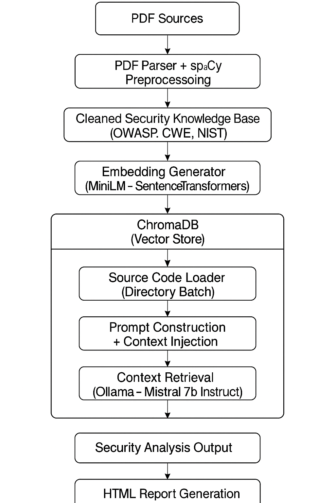
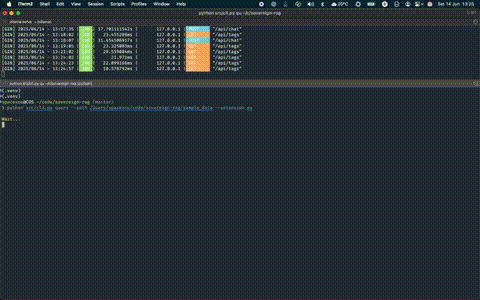

## Building My Own Sovereign RAG for Secure Code Analysis

Lately, I’ve been taking a closer look at some code analysis tools that claim to detect security vulnerabilities in software projects. The idea itself is solid. I got one of these tools recommended to me and decided to dig deeper to see what’s really behind these solutions.

Pretty quickly I noticed a pattern: these platforms are far from cheap. Some offer limited free plans, but we all know how this game works. When something that good is offered for “free”, the real price usually comes from somewhere else — data collection, vendor lock-in, black-box models processing your code in someone else’s cloud. And since I’ve been deeply studying AI lately, especially Retrieval-Augmented Generation (RAG), the question came naturally: why not build my own pipeline, fully local, sovereign, using open-source tools, running on my own machine, and depending on no one?

That’s how [SovereignRAG](https://github.com/spacexnu/sovereign-rag) was born.

### How it works

The core idea was simple: feed my RAG with strong technical knowledge from reputable security sources. I went straight to materials like OWASP Top 10, CWE, NIST, and other well-established security references. From there, I followed this strategy:
1.	Collect the original sources in PDF format (OWASP Top 10, CWE, NIST, etc).
2.	Build a parser to extract text from these PDFs. To clean the data, I used NLP with spaCy, removing noise and filtering only what really matters. The processed data is then stored into ChromaDB as a vector store.
3.	Develop a specific prompt, initially hardcoded into the project. My next step is to make this more dynamic and flexible, allowing the tool to adapt to different use cases and projects.
4.	As language model, I’m running Ollama locally with the mistral:7b-instruct model. It’s not a gigantic model, but it’s also not as limited as the phi3-instruct I tested earlier. Given my hardware limitations, it was the best balance I found.

Everything runs entirely on my personal MacBook Air M1 with 16GB of RAM. Obviously, this isn’t instantaneous. Local LLM inference is CPU intensive, especially when dealing with long inputs and dense technical context. But the main point of the experiment is proven: it’s fully possible to run a sovereign RAG pipeline, offline, keeping all data under my full control, without sending anything to any cloud, and especially, without paying absurd SaaS prices for these so-called “intelligent” solutions popping up everywhere.

I already have several improvements in mind. Parallelism isn’t one of them for now — I don’t plan to burn my Mac’s SSD swapping like there’s no tomorrow.

### Technical Architecture

Since the main goal was always full control of the pipeline, I designed the SovereignRAG architecture to be modular, with each step clearly separated and built entirely on open-source tools I can fully manage locally. No external dependencies.

The pipeline works like this:

**1. Ingesting security documents**

The first step was collecting and processing the knowledge base that feeds the RAG. I used official security documentation in PDF format, including OWASP Top 10, CWE, and NIST. For text extraction, I used PyMuPDF to parse the PDFs and spaCy to clean up, tokenize, and remove irrelevant content. This stage matters because unnecessary noise directly affects the quality of embeddings generated later.

**2. Embeddings and vector indexing**

Once the content was cleaned, I used the all-MiniLM-L6-v2 model from SentenceTransformers to generate embeddings. These vectors were stored into ChromaDB, a lightweight and efficient vector database that runs smoothly on local hardware without any crazy requirements.

**3. Querying and code analysis**

For code analysis, the pipeline reads the source file, injects its contents into the pre-defined prompt, retrieves the most relevant documents from the vector store (top_k carefully controlled to avoid overloading the model), and triggers inference.

The inference runs locally via Ollama using the mistral:7b-instruct model. This model has been the best balance I found between reasoning capacity, longer context window support, and practical viability on my limited hardware.

**4. Report generation**

Instead of dumping everything to the terminal, I added HTML report generation for each analyzed file. This allows me to review results more easily and opens the door for building a proper web interface in the future.

### Challenges, Limitations, and Lessons Learned

Of course, there’s no magic here. Running a sovereign, offline, local RAG pipeline for secure code analysis over complex security knowledge bases comes with very real challenges. This is not some SaaS plug-and-play solution, and it’s definitely not for everyone.

The first thing that hits immediately is hardware itself. LLMs are heavy. I’m running this on a MacBook Air M1 with 16GB of RAM — which is a great machine for a lot of things, but it’s absolutely not designed for large-scale AI inference workloads. This forced me to make very pragmatic decisions from the start: fully serial processing (one file at a time), strict control over context size (carefully tuned top_k), aggressive chunking during ingestion, and absolutely no parallelism. Trying to parallelize this would simply turn into thermal suicide and unnecessary SSD wear from constant swapping.

Another important challenge is how LLMs behave when receiving dense technical context. I learned quickly that you can’t just inject entire documentation dumps and expect the model to figure everything out. There’s careful prompt engineering involved here to guide the model into the right path without overwhelming it with unnecessary noise.

There’s also a constant balancing act between embedding quality and local inference performance. The MiniLM model was a good starting point to generate compact and efficient embeddings, but I already see room to experiment with more advanced models like BGE and Instructor in future iterations.

And of course, the most obvious challenge: speed. You can’t run this locally and expect instant responses, especially with 7B models. Every analysis takes time. This isn’t something you plug into a CI/CD pipeline (yet), but as a sovereign lab and proof of concept, it performs its job exactly as intended.

### Next steps and evolution

SovereignRAG started as a lab experiment, but it’s already pointing toward interesting expansion paths. The current architecture works well to validate the concept of sovereign RAG applied to secure code analysis, but there are several layers of improvements I plan to introduce.

The first target is refining chunking during document ingestion. This is one of the most critical aspects of any RAG pipeline. Wrong chunking equals wrong context. There’s a fine balance to strike here between chunk granularity, embedding quality, and vector store recall capacity.

Embeddings are another natural evolution point. Today I’m using all-MiniLM-L6-v2 because of its lightweight footprint and practical viability on my current setup, but I’m keeping an eye on more advanced models like BGE and Instructor, which might generate more precise semantic embeddings for this type of data.

On the inference side, there’s room to explore additional models beyond mistral:7b-instruct. Eventually I may test Mixtral or experiment with optimized quantization approaches to improve performance on limited hardware. I’m also not discarding the idea of building a dedicated sovereign server later to handle these workloads more fluidly, preserving my MacBook for development and content production.

Another short-term goal is making the pipeline more flexible and configurable. Right now the prompt is hardcoded into the codebase. The plan is to externalize this configuration, allow for easier adjustments, and even implement template-based analysis for different project types or languages.

Finally, the bigger move over the mid-term is evolving what today is a lab into a real product. SovereignRAG already serves as a foundation for what could become CodeTalon — a professional, private, offline, sovereign secure code analysis product for corporate environments, free from third-party APIs, shadow clouds, or overpriced SaaS traps.

The concept is planted. Now it’s a matter of refining the machine and sharpening the blade.

